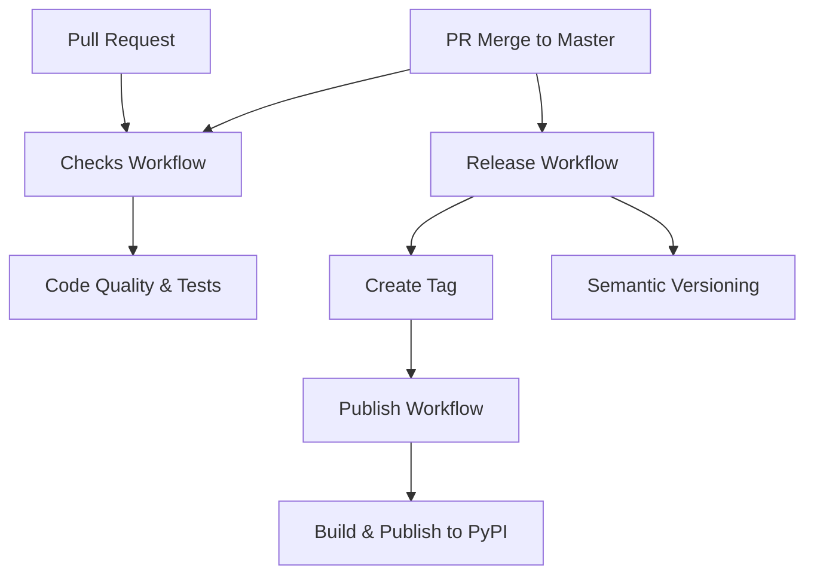

# CI/CD Pipeline Documentation

This repository uses a three-workflow CI/CD pipeline for automated testing, versioning, and publishing.

## Workflow Overview

## Workflows

### 1. 🔍 **Checks** (`checks.yml`)
**Triggers:** Pull requests + pushes to main branches

**Purpose:** Quality gates and validation
- **Commit validation** - Ensures conventional commit format
- **Code quality** - Black formatting, Ruff linting, Bandit security scanning
- **Testing** - Multi-version Python testing with real MQTT broker
- **Build validation** - Ensures package can be built

### 2. 🏷️ **Release** (`release.yml`)
**Triggers:** Pushes to main branches (with smart filtering)

**Purpose:** Semantic versioning and tag creation
- **Analyzes commits** since last release using conventional commits
- **Creates version tags** (e.g., `v1.2.3`) when releasable changes are found
- **Generates changelogs** and GitHub releases
- **Automatically skips** duplicate runs from semantic-release's own commits

### 3. 🚀 **Publish** (`publish.yml`)
**Triggers:** Tag creation (`v*` tags)

**Purpose:** Build and publish packages
- **Builds distribution packages** (wheel + sdist) from tagged commit
- **Validates packages** with twine
- **Publishes to PyPI** using trusted publishing
- **Uploads build artifacts** for debugging

## Expected Flow

### Normal PR Merge:
1. **Developer creates PR** → `Checks` runs ✅
2. **PR gets merged** → `Checks` + `Release` run ✅
3. **Release creates tag** → `Publish` runs ✅
4. **Package published** to PyPI ✅

### When semantic-release creates commits:
1. **Release workflow runs** and creates version commits/tags
2. **Second Release workflow triggered** by version commit → **Skipped** ✅ (expected)
3. **Publish workflow triggered** by tag → Runs ✅

## Why Some Workflows Show "Skipped"

You may see **"Release: Skipped"** workflows in the Actions tab. This is **expected behavior**:

- Semantic-release creates commits when updating versions
- These commits trigger the Release workflow again
- Our smart filtering detects commits authored by `semantic-release` and skips them
- This prevents infinite loops and duplicate releases

**Skipped workflows are a feature, not a bug!** They indicate the filtering is working correctly.

## Configuration

### Semantic Release
- **Version files:** `pyproject.toml`, `src/*/__init__.py`
- **Commit analysis:** Conventional commits (feat, fix, docs, etc.)
- **Changelog:** Auto-generated from commit messages
- **GitHub releases:** Created automatically with artifacts

### Testing
- **Python versions:** 3.8, 3.9, 3.10, 3.11, 3.12
- **MQTT broker:** Real Mosquitto instance for integration tests
- **Coverage:** Optional coverage reporting available

### Security
- **Code scanning:** Bandit for security vulnerabilities
- **Dependency scanning:** pip-audit for known CVEs
- **Secret scanning:** TruffleHog for exposed secrets
- **Trusted publishing:** Secure PyPI publishing without API tokens

## Troubleshooting

### Common Issues:

**Multiple workflow runs:**
- Check if semantic-release filtering is working
- Look for "skipped" status on duplicate runs

**Failed releases:**
- Ensure commit messages follow conventional format
- Check if there are actual releasable changes since last tag

**Failed publishing:**
- Verify PyPI trusted publishing is configured
- Check build artifacts for packaging issues

**Test failures:**
- Ensure MQTT broker is accessible
- Check system dependencies are installed

### Debug Information:

Each workflow includes detailed logging. Check the workflow logs for:
- Commit analysis results
- Build outputs and validation
- Test results with coverage
- Publishing status and package validation

## Conventional Commits

This project uses [Conventional Commits](https://www.conventionalcommits.org/) for automated versioning:

- `feat:` → Minor version bump (1.2.0 → 1.3.0)
- `fix:` → Patch version bump (1.2.0 → 1.2.1)
- `docs:`, `style:`, `refactor:`, `test:` → No version bump
- `BREAKING CHANGE:` → Major version bump (1.2.0 → 2.0.0)

## Manual Overrides

All workflows support manual triggering via `workflow_dispatch` for testing and emergency releases.
